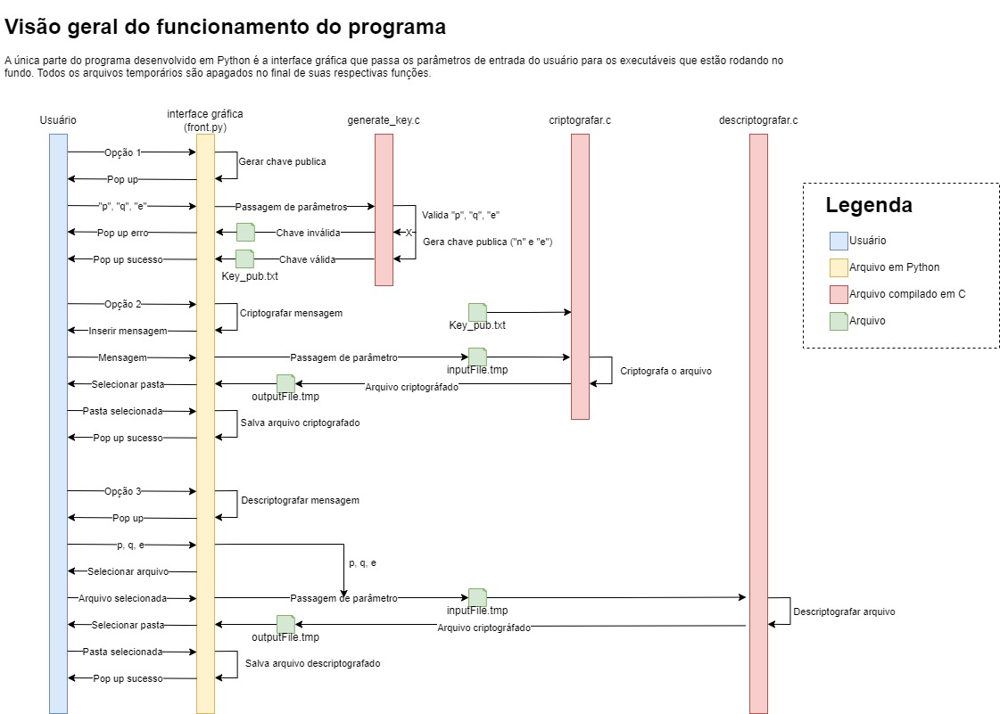

[TOC]

# Projeto de criptografia RSA
**Universidade Federal de Alagoas - UFAL | Instituto de Computação - IC**

## Objetivo acadêmico
Projeto apresentado à turma de **Matemática Discreta** do curso de Engenharia da Computação como parte dos requerintes para obtenção da nota AB2.

Doscente: **
Bruno Almeida Pimentel**

Discentes: **
Jader Neto
Pedro H. B. Rocha
Pedro H. V. Giló
Ronald Lopes
F. Samuel O. P. dos Santos
**

## Objetivo do projeto
Desenvolver um programa na linguagem de programação C que realize a seguinte tarefa:

• **Solicite que o usuário escolha entre 3 opções:**
1 - Gerar chave pública
2 - Encriptar
3 - Desencriptar

• **Caso escolhida a opção 1 - Gerar chave pública:**
– Solicite que o usuário digite um par de números primos p e q e um expoente
e relativamente primo a (p − 1)(q − 1).
– Salve, no diretório de execução do programa, um arquivo txt com os dois
números que formam a chave pública.

• **Caso escolhida a opção 2 - Encriptar:**
– Solicite que o usuário digite a mensagem de texto a encriptar.
– Solicite que o usuário digite a chave pública recebida previamente.
– Salve, no diretório de execução do programa, um arquivo txt com a mensagem encriptada.

• **Caso escolhida a opção 3 - Desencriptar:**
– Solicite que o usuário digite p, q e e.

## Estrutura geral do programa

# Pré requisitos
* GCC, se for compilar em versões diferentes do SO (Nativamente o programa foi compilado Windows 64x).
* Python 3.11 ou superior.
* Biblioteca PyQt6.

        pip install PyQt6

# Inicializando programa
Para rodar o programa, basta executar o arquivo front.py.